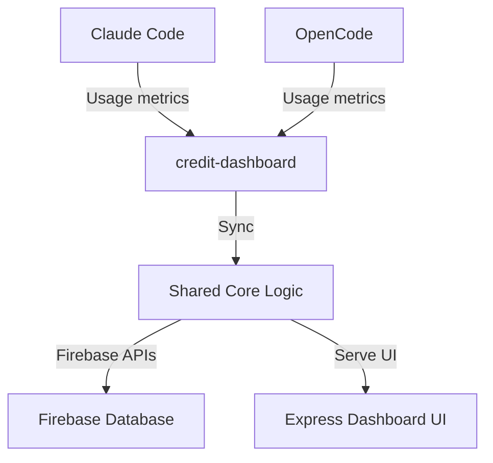

# credit-dashboard

Credit and billing dashboard plugin for OpenCode and Claude Code. Tracks usage metrics, manages API credits, and synchronizes state via Firebase.

## Architecture

## Structure

- `src/` - Shared core logic (Firebase sync, metrics aggregation)
- `claude/` - Claude Code specific wrappers (standalone processes)
- `opencode/` - OpenCode specific wrappers (inline IDE plugins)
- `dist/` - Single compiled output supporting both environments

## License

MIT
